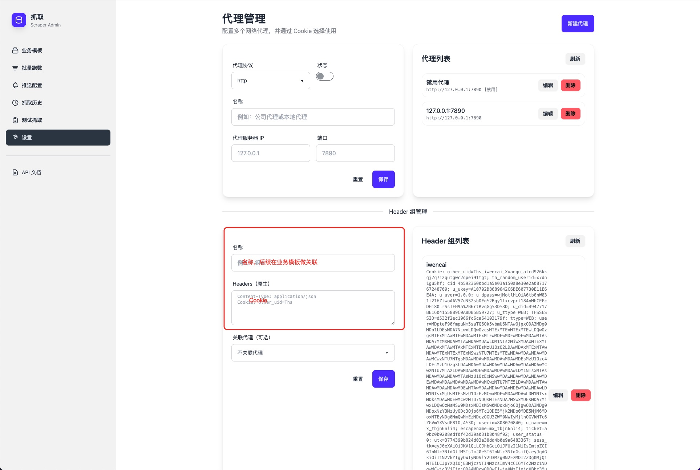
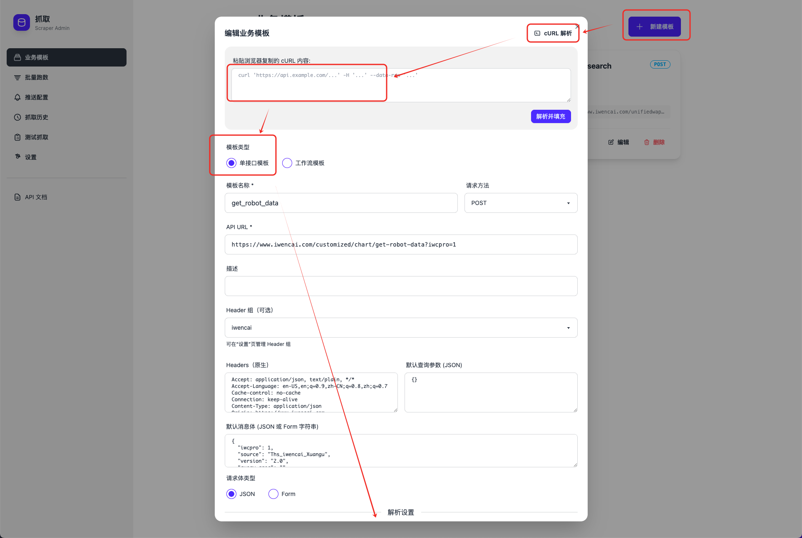
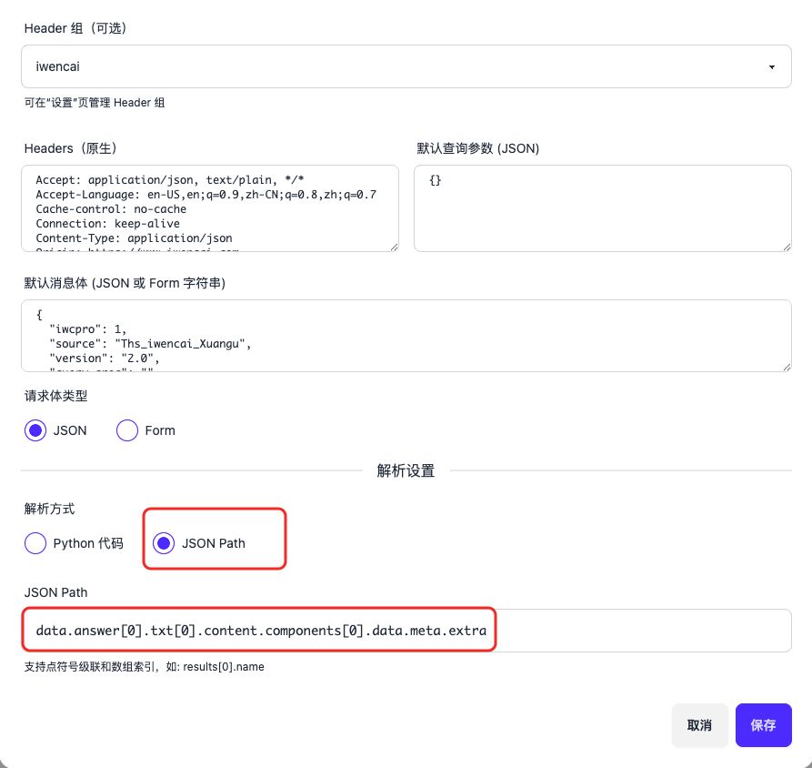
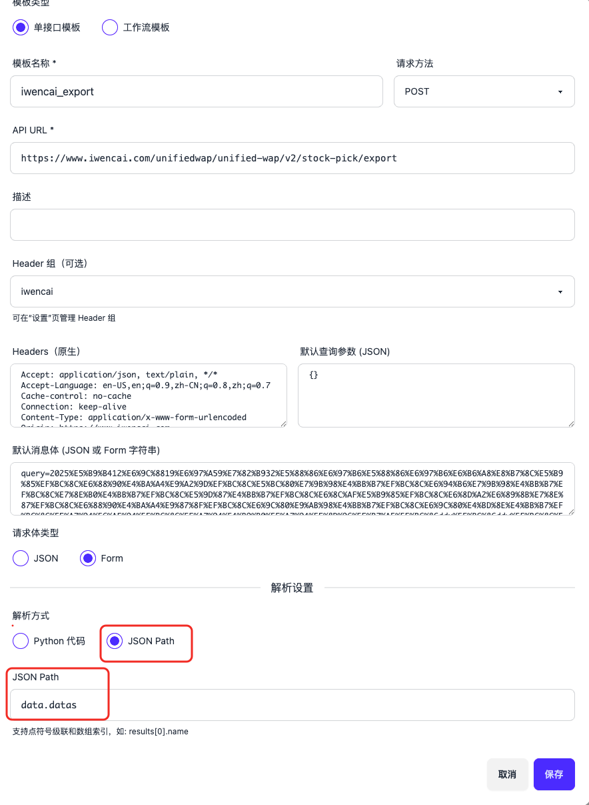
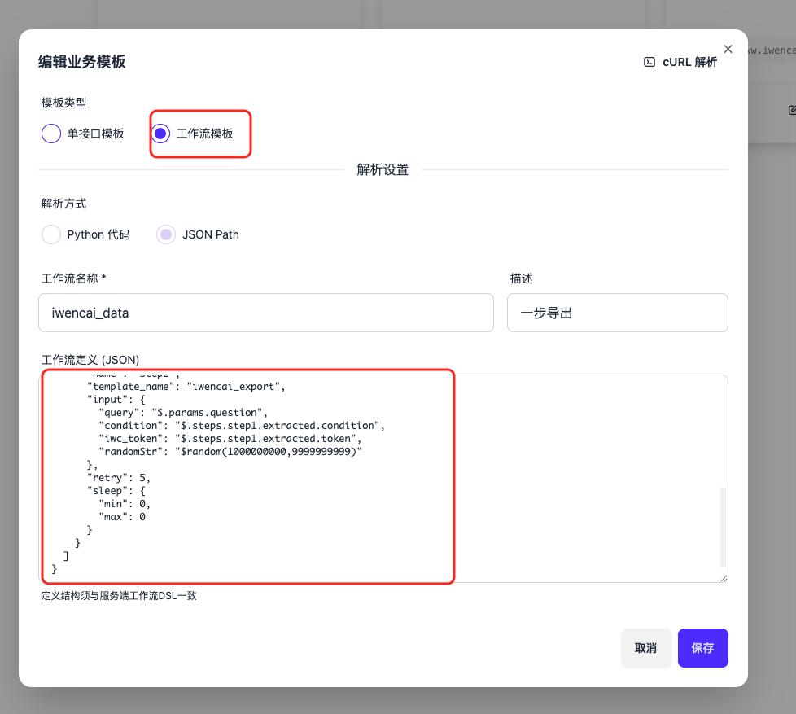

1. 创建Header组（主要为了保存认证信息）
> 需要包括Cookie和Hexin-v



2. 创建get_robot_data模板，将查询query转换成机器可读的格式
> 选择单接口模板，从浏览器复制cURL解析自动填充
> Header组选择第一步创建的
> 解析选择Json Path：路径填写为 data.answer[0].txt[0].content.components[0].data.meta.extra




3. 创建iwencai_export模板，导出数据
> 选择单接口模板，从浏览器复制cURL解析自动填充
> Header组选择第一步创建的
> 解析选择JSON Path：路径为 data.datas



4. 创建iwencai_data模板，组合get_robot_data和iwencai_export模板
> 选择工作流模板，填写工作流定义

工作流定义👇
```json
{
  "description": "先调用get_robot_data获取condition/token，再调用iwencai_export获取最终数据",
  "steps": [
    {
      "name": "step1",
      "template_name": "get_robot_data",
      "input": {
        "question": "$.params.question"
      },
      "extract": {
        "condition": "$.condition",
        "token": "$.token"
      },
      "retry": 5,
      "sleep": {
        "min": 0,
        "max": 1
      }
    },
    {
      "name": "step2",
      "template_name": "iwencai_export",
      "input": {
        "query": "$.params.question",
        "condition": "$.steps.step1.extracted.condition",
        "iwc_token": "$.steps.step1.extracted.token",
        "randomStr": "$random(1000000000,9999999999)"
      },
      "retry": 5,
      "sleep": {
        "min": 0,
        "max": 0
      }
    }
  ]
}
```

5. 请求工作流模板
```shell
curl --location 'http://localhost:8000/api/scrape/simple' \
--header 'Content-Type: application/json' \
--data '{
    "template_name": "iwencai_data",
    "params": {
        "question": "2025年12月29日14点50分时分时涨跌幅"
    }
}'
```